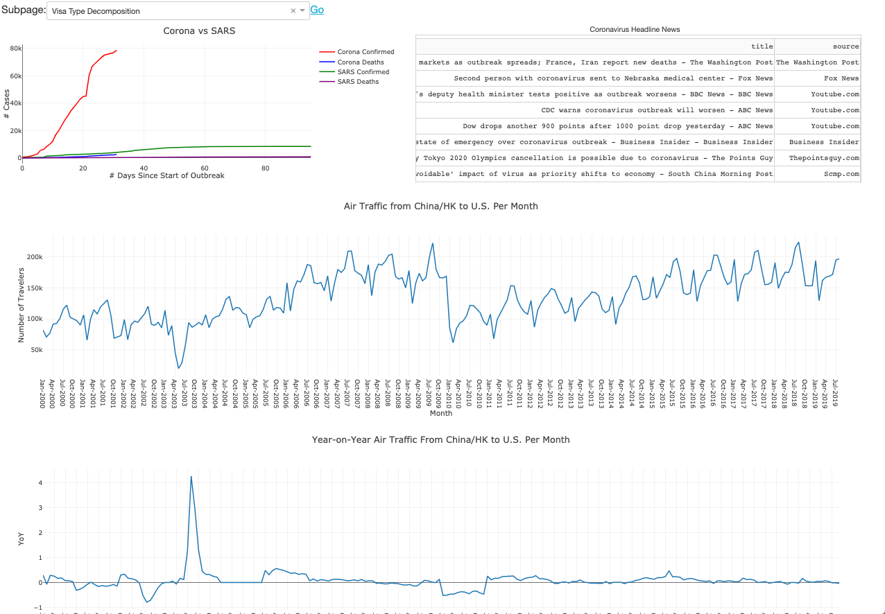

# brown_datathon20
## Airline Outlook 2020
### an Information Dashboard exploring the impacts of nCOVID-19 on international travel.

## Welcome to our Corona Dashboard! 

This project is our submission for the [Brown 2020 Datathon](https://browndata.org/datathon/). 

### Our primary goals in creating this dashboard are:
* presenting a user-friendly data visualiation application to portfolio managers
* enable modularity and scalability 
* explore a variety of alternative data sources
* leverage interactive visualizations using Plotly 
  
### There are 4 main subpages on this dashboard:
* Visa Type Decomposition (2019)
* Coronavirus Details
* Travel by Nationality
* Ports of Entry

### Updates
**== 2/25/20 ==**
The application has successfully been deployed using Heroku! 

Visit the dashboard at https://airline-outlook-2020.herokuapp.com/.

### Debugging Locally
To launch the application locally, make sure you are in the directory with `index.py`.
Then, type in `python index.py` and open the dashboard in your browser. 

#### Created by:
* Angela Jin 
* Bonnie Nguyen
* Jacquelyn Blum
* Ziwei Li 
